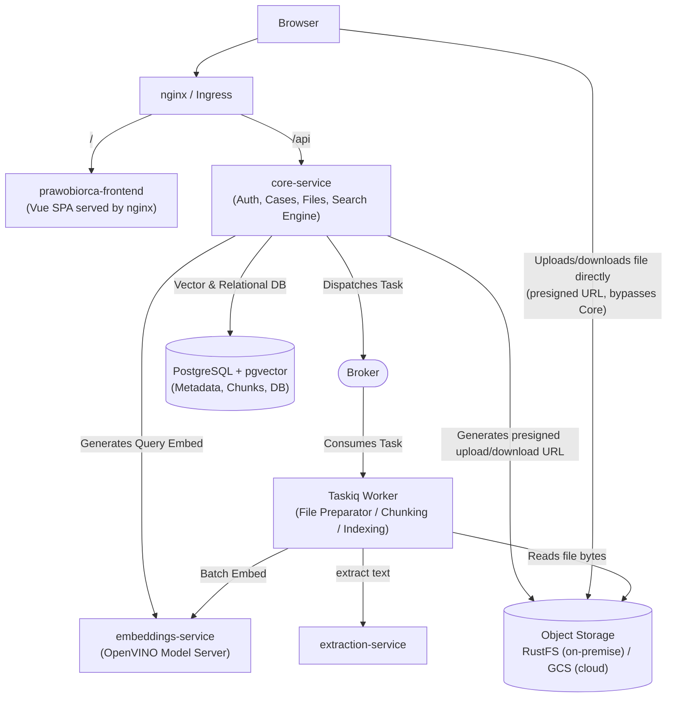
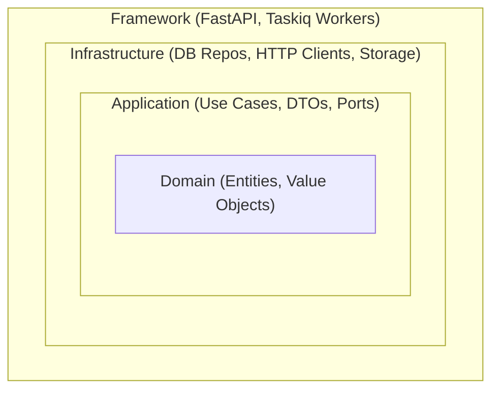

# Application Architecture

## 1. Introduction and System Overview

**Prawobiorca** is a modern web application providing intelligent legal search and document management capabilities. The system supports AI-assisted (semantic vector search) retrieval of legal acts, as well as case management and document drafting for authenticated users.

The whole application lives in a single repository: the Python backend services described below, and the Vue frontend (`prawobiorca-frontend`) documented in [Frontend](frontend.md).

The system is designed to run in two primary environments:
- **Cloud (GCP / Google Cloud Platform)**: Utilizing containerized workloads with scale-to-zero capabilities for resource-heavy operations to optimize cost and resource allocation.
- **On-Premise**: Running containerized services using **Podman** / Docker.

---

## 2. System Architecture & Components

The architecture follows a **Monolith** pattern for core business logic, paired with **specialized microservices** for compute-heavy tasks:

### 2.1. `core-service` (Main API & Taskiq Worker)
Hosts the core domain logic, user-facing endpoints, and background document indexing within a single modular codebase:
* **Core API (FastAPI)**:
  * User authentication, authorization, and profile management.
  * Case (*Sprawy*) management and document metadata handling (filenames, upload status, permissions).
  * Storage orchestration: generates presigned upload/download URLs (S3 presigned POST/GET) so the browser transfers file bytes directly with object storage — `core-service` never proxies the bytes itself. The Taskiq worker separately reads the raw bytes back from storage for processing.
  * Fast synchronous search execution: requests single query embeddings from `embeddings-service` and performs vector similarity search against PostgreSQL (`pgvector`).
  * Dispatches asynchronous file processing tasks to the broker using **Taskiq**, automatically upon upload confirmation — no separate request is needed to start indexing.
* **File Preparator (Taskiq Worker)**:
  * Consumes document preparation jobs from the Taskiq broker.
  * Coordinates document processing pipeline: sends file to `extraction-service`, chunks structured text, requests batch embeddings from `embeddings-service`, and persists vector embeddings into PostgreSQL.
  * Chunking follows the editorial structure of the act (article / paragraph, with its chapter breadcrumb) recovered from the text itself, not the layout labels returned by `extraction-service` — see [Legal documents parsing](legal_documents_parsing.md).
  * Updates document processing status in PostgreSQL directly without inter-service RPC overhead.
  * Retries a document up to 3 times when `extraction-service` or `embeddings-service` is unavailable; after the last attempt the document is marked as failed and can be retried on demand.

### 2.2. `embeddings-service`
* **Responsibilities**:
  * Dedicated, stateless service generating dense vector embeddings for text chunks and search queries with the Polish retrieval model `sdadas/mmlw-retrieval-roberta-large-v2` (int8), served directly by **OpenVINO Model Server (OVMS)** — no custom application code — via the OpenAI-compatible `/v3/embeddings` endpoint.
* **Characteristics**:
  * **Isolated Compute**: Heavy tensor computation and embedding model memory footprints are completely decoupled from the main API, preventing thread blockage and memory spikes.
  * **Independent Scaling**: Can be scaled independently (e.g., on GPU or high-CPU compute instances) based on search traffic and document ingestion volume.
  * A single endpoint accepts both single texts and batches.

### 2.3. `extraction-service`
* **Responsibilities**:
  * Document layout analysis, and text extraction (PDFs) into structured JSON format, using Docling.
* **Characteristics**:
  * Completely stateless service.
  * **Scale-to-0 on GCP**: a KEDA `HTTPScaledObject` (HTTP add-on) scales the Deployment between 0 and 1 replicas based on incoming request volume. `core-service` reaches it through the `extraction-service-proxy` ExternalName Service, which points to the add-on's interceptor proxy; the interceptor holds the request until the replica is ready.
  * **Fast cold start**: the image uses CPU-only PyTorch and has the Docling models (layout, TableFormer, RapidOCR) baked in, so no model download happens at startup; models are loaded eagerly before the service reports healthy.
  * Runs as a dedicated container in On-Premise deployments (single replica, no scale-to-0).

### 2.4. `llm-service`
* **Responsibilities**:
  * Conversational LLM inference (Gemma-4 E4B, int8-quantized), served directly by **OpenVINO Model Server (OVMS)** — no custom application code — exposing an OpenAI-compatible `/v3/chat/completions` HTTP endpoint.
* **Characteristics**:
  * Not yet wired into `core-service` — this is a first, isolated deployment step; a future iteration will add the client/use-case integration needed to expose a conversational feature to end users.
  * OVMS pulls the model from Hugging Face straight into a persistent volume on first start (cached across restarts after that), so no image build/model-baking step is needed for this service.
  * On-Premise uses `--target_device=AUTO` with `/dev/dri` passed through, so it runs on the Intel iGPU when the host exposes one and transparently falls back to CPU otherwise. GCP stays on CPU (GKE Autopilot only supports NVIDIA GPU passthrough). This model has no continuous-batching support yet, so there's no throughput benefit from OVMS's usual batching path either way.
  * **Scale-to-0 on GCP**: a KEDA `HTTPScaledObject` (HTTP add-on) scales the Deployment between 0 and 1 replicas based on incoming request volume, since the model's RAM footprint is too large to keep idle. Requires KEDA and its HTTP add-on installed on the cluster. Once scaled to 0, traffic must reach it through the add-on's interceptor proxy rather than the `llm-service` Service directly — relevant for the future `core-service` integration.

### 2.5. `prawobiorca-frontend`
* **Responsibilities**:
  * Single-page application (Vue 3 + TypeScript) delivering the whole user interface: search, authentication, case and document management.
* **Characteristics**:
  * Built with Vite into static assets and served by **nginx** from its own container; no server-side rendering and no application server.
  * Communicates only with `core-service` over the HTTP REST API, under the `/api` prefix of the shared ingress — it never reaches the database or the compute services directly.
  * Stateless from the deployment point of view: the session lives in cookies issued by `core-service`.
  * See [Frontend](frontend.md) for the stack, project structure and development commands.

---

## 3. Key Architectural Decisions & Patterns

### 3.1. Monolith for Core Business (`core-service`)
* **Simplicity & Velocity**: Simple monolith, but with clean architecture, possibly to modularize, if team growth.
* **Architecture**: Use cases and domain entities for documents, cases, with separate layers for framework, and infrastructure (e.g. db connection).

### 3.2. Asynchronous Job Processing with Taskiq
* **Modern Async-First Design**: Native integration with FastAPI and asynchronous Python runtimes.
* **Broker Agnostic**: Supports Redis, RabbitMQ, or other brokers with minimal configuration changes.
* **Resilience**: Provides built-in retry mechanisms, failure handling, and transparent task parameter serialization.

### 3.3. Compute Decoupling (Embeddings & Extraction)
* **Resource Isolation**: CPU/GPU-intensive tasks (OCR extraction and vector embedding generation) reside in specialized microservices.
* **Guaranteed Latency**: The primary web API stays lightweight, responsive, and fast under heavy indexing workloads.

---

## 4. More about core-service architecture

Each Python service in the repository follows **Clean Architecture** principles, enforcing strict inward-pointing dependency rules. The frontend is not bound by these rules — its structure is described in [Frontend](frontend.md).

### 4.1. Layers

#### `../../core-service/src/domain`
The innermost core of the service containing **Enterprise Business Rules**. It has zero dependencies on outer layers or external frameworks.
- **Entities**: Business models encapsulating identity and business state (e.g., `User`, `Case`, `Document`, `Chunk`).
- **Value Objects**: Immutable data structures representing concepts without identity.
- **Services**: Pure business algorithms and domain rules.
- **Exceptions**: Domain-specific error definitions.

#### `../../core-service/src/app` (or `../../core-service/src/app`)
Contains **Application Business Rules** and use case orchestrations.
- **Use Cases**: Individual business workflows (e.g., `RegisterUser`, `ProcessUploadedDocument`, `SearchDocuments`).
- **DTOs**: Data Transfer Objects defining input/output contracts.
- **Ports & Interfaces**: Abstract contracts for repositories, vector embedders, and external APIs implemented by the Infrastructure layer.

#### `../../core-service/src/infrastructure`
Acts as adapters for external systems and technical tools, implementing ports defined in domain/application.
- **Relational DB**: SQLAlchemy repositories, connection pools, and database schemas.
- **External Clients**: HTTP/gRPC clients communicating with external services (`embeddings-service`, `extraction-service`).
- **Object Storage**: a single S3-protocol adapter (`aiobotocore`), reused unchanged against RustFS on-premise and against Google Cloud Storage's S3-interoperability endpoint in the cloud. A separate "presign" client, pointed at a public endpoint URL, keeps presigned URLs handed to the browser reachable even when the internal endpoint isn't.

#### `../../core-service/src/framework`
The outermost delivery mechanism and dependency injection root.
- **API**: FastAPI routes, middleware, and request/response serialization.
- **Workers**: Taskiq worker definitions and task registrations.
- **Dependencies**: Dependency injection wiring combining infrastructure implementations with application use cases.

#### `../../core-service/src/shared`
Cross-cutting concerns across layers (configuration settings, logging utilities, common base exceptions).

---

## 5. Import Rules

To preserve architectural boundaries:
- **`domain`** must NOT import from `app`, `infrastructure`, or `framework`.
- **`app`** can import from `domain`, but must NOT import from `infrastructure` or `framework`.
- **`infrastructure`** can import from `app` (interfaces, DTOs) and `domain`. It must NOT import from `framework`.
- **`framework`** is the assembly root and can import from `app`, `domain`, and `infrastructure` to wire dependencies.
- **`shared`** can be imported by any layer, but should not depend on domain or infrastructure specifics.
